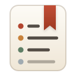
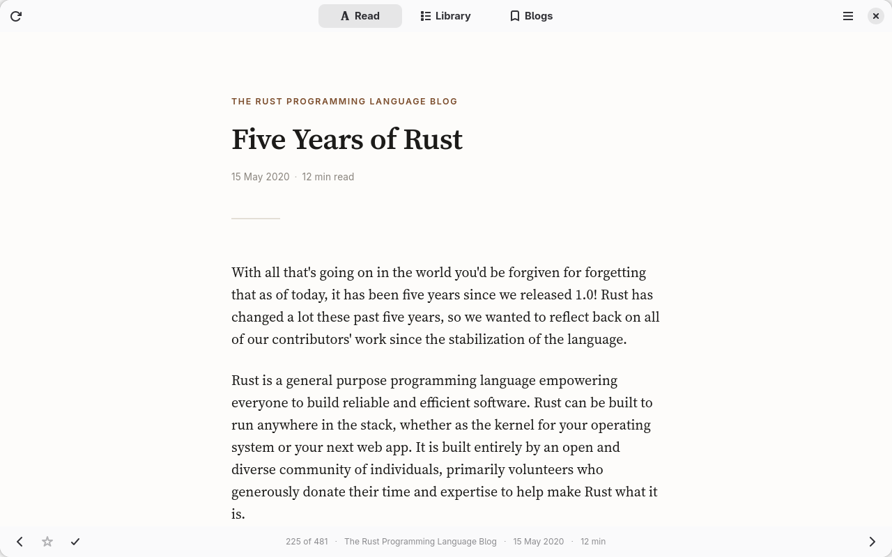
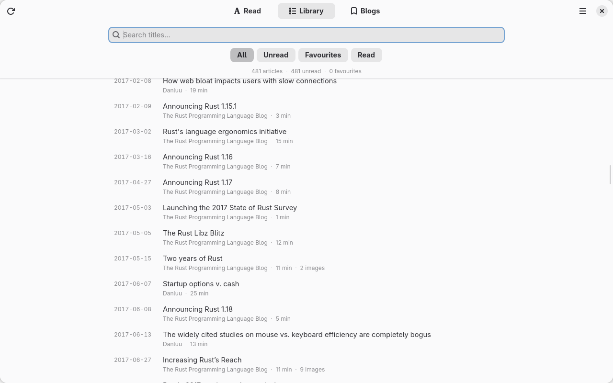

<div align="center">
  
  <h1>Chronicle</h1>
  <p><strong>Read the blogs you follow in one queue, oldest first.</strong></p>
</div>

---

Add the blogs you read. Chronicle goes back and collects everything they have
ever published, then puts it all in a single list ordered by when it was
written — no matter which blog it came from.

```
2004-03   Blog A     An early post
2004-07   Blog C     Something from the same summer
2005-01   Blog B     …
2005-02   Blog A     …
```

So you can start at the beginning and just keep reading.

<div align="center">
  
</div>

## Why not just use a feed reader

A feed reader shows you what's new. Chronicle goes and gets what came before.

Most RSS feeds only list the last handful of posts, so a feed reader can never
show you a blog's back catalogue. Chronicle works through every route a blog
offers — its own API where one exists, otherwise its feed, its sitemaps and
its archive pages combined — and merges what they know: the sitemap's
completeness with the feed's exact dates and full text, and the dates a
blog's own index prints beside each post.

It also gets the dates right, which matters when the whole point is reading in
order:

- It uses the **original** publication date, never the day it found the article.
- Where a blog only says "February 2002", it shows *February 2002* rather than
  inventing a day.
- Where a date is a genuine guess, it says *circa* and tells you why.
- Where there's no date to be had, the article goes in an **Undated** list
  instead of being dropped somewhere wrong in your queue.

## Install

```sh
flatpak install flathub io.github.mvinhas.Chronicle
```

Then open **Blogs**, paste in a blog address, and press **Full archive scan**.

The first run takes a while — it's fetching a blog's entire history, and it
goes slowly on purpose so as not to hammer anyone's website. After that,
**Fetch new posts** picks up only what's appeared since, which takes seconds.

<div align="center">
  
</div>

## Reading

Open it, and you're on the next article. Read it, press `→`, read the next one.
It remembers where you got to.

| | |
|---|---|
| `→` `N` `J` | next article |
| `←` `P` `K` | previous article |
| `Space` | scroll |
| `F` | favourite |
| `R` | mark read / unread |
| `S` | skip, and go to the next |
| `L` / `Esc` | back to the list |
| `Ctrl+F` | search |
| `Ctrl+T` | light / dark theme |
| `F5` | fetch new posts |
| `Shift+F5` | full archive scan |

Articles are stored on your machine, images included, so everything keeps
working offline.

## Notes and highlights

Select any passage while you're reading to highlight it, and click a highlight
to attach a note to it. There's also a note box at the foot of every article
for anything you want to say about the piece as a whole.

Highlights are anchored to the words themselves rather than to a position in
the file, so they stay put when a blog edits a post or Chronicle re-fetches it.
If the text a highlight marked really does disappear, the highlight is kept and
listed as no longer present rather than quietly thrown away.

While the note box has focus the single-key reading shortcuts stand down, so
you can type freely; `Esc` leaves the box and saves what you wrote.

The library has a **Notes** filter listing everything you annotated, with what
you wrote shown under each article.

All of it stays on your machine, and an archive update never overwrites it.

## Skipping what you don't want

Not everything a blog publishes is for you. Press `S` and Chronicle passes the
article over and moves you to the next one — it leaves the queue rather than
counting as read, so the two never get confused. There's an **Undo** on the
way out if you change your mind, and a **Skipped** filter in the library that
lists them all and puts any of them back.

The **Blogs** tab then shows what proportion of each blog you have skipped:

```
Peter Attia MD    412 readable  ·  2018–2026  ·  62% skipped
Wait But Why      184 readable  ·  2013–2026  ·  4% skipped
```

Which is the useful part — it tells you, from your own reading rather than a
guess, which blogs are earning their place in the queue.

## Keeping up to date

Two different jobs, so two buttons:

- **Fetch new posts** — what each blog has published since the last update. It
  reads the routes that list newest-first and stops as soon as it reaches what
  you already have, so it's a matter of seconds. This is `F5`, and what you
  want almost every time.
- **Full archive scan** — re-examines each blog's whole history. Slow. Use it
  after adding a blog, or to fill in gaps.

## A blog isn't working properly?

Some sites need special handling, and Chronicle ships a few purpose-built
adapters for ones that do. If a blog you read comes out with missing posts or
wrong dates,
[open an issue](https://github.com/MVinhas/chronicle/issues/new?labels=adapter-request)
with the address and what looks wrong.

## Building it yourself

```sh
git clone https://github.com/MVinhas/chronicle
cd chronicle
./build-flatpak.sh
```

Needs Flatpak and the GNOME 50 runtime. There's a command-line interface too,
and notes on how it all fits together, in [CONTRIBUTING.md](CONTRIBUTING.md).

## Licence

[GPL-3.0-or-later](LICENSE). The reading typeface is
[Source Serif 4](https://github.com/adobe-fonts/source-serif), under the SIL
Open Font License.
